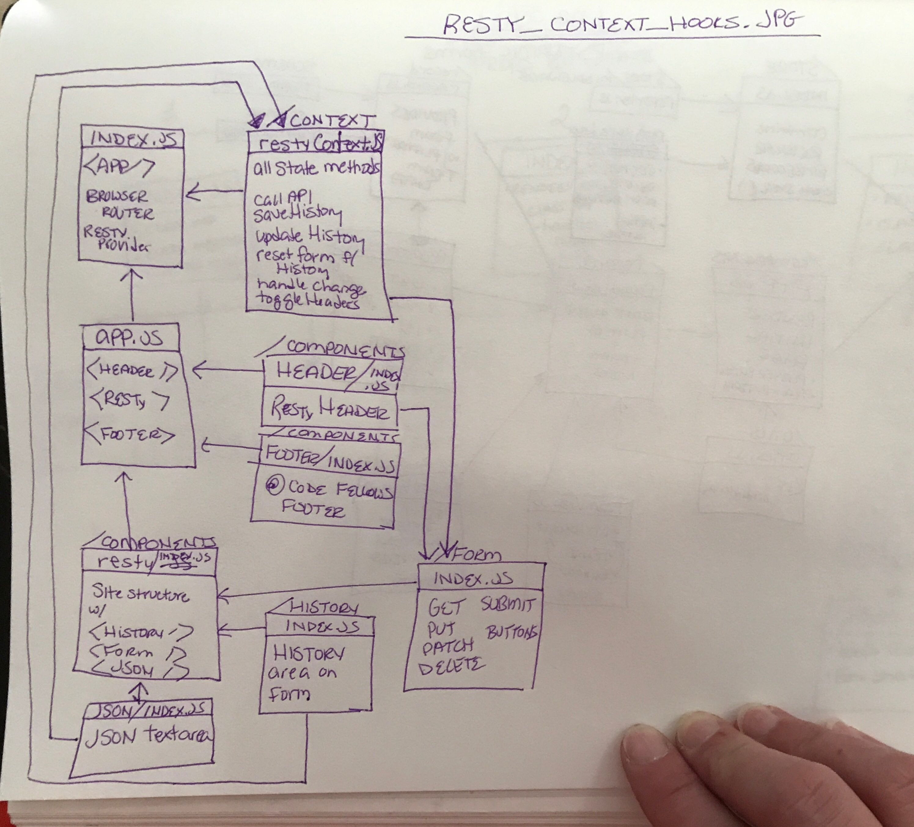

# Lab RESTy: Context and Hooks

### Author: Chloie Parsons

## Links and Resources

- [Codesandbox: Lab RESTy: Context and Hooks](https://codesandbox.io/s/resty-fiq12)
- [GitHub: Lab RESTy: Context and Hooks](https://github.com/chloieparsons-401-advanced-javascript/Lab-RESTY-Context-and-Hooks)
- [Netlify: Lab RESTy: Context and Hooks](https://lucid-mestorf-7e11b1.netlify.com/)

## Modules

- Index.js (Renders the app)
- App.js (Collects and renders all the components)
- Resty/index.js (Gathers all the components, contains state, and handlers; functionality of site as well)
- Form/index.js (Form style and structure)
- Header/index.js (The `RESTy` header)
- Headers/index.js (The Basic Authorization and Bearer Token portion of the application page)
- Footer/index.js (The `@2019 Code Fellows` footer)
- json/index.js (The JSON textbox)
- History/index.js (The History component of the form)
- restyContext/index.js (The context file that has state and app functionality in its entirety)


## Setup (Dependencies)
```
"@babel/core": "7.4.3",
"@svgr/webpack": "4.1.0",
"@typescript-eslint/eslint-plugin": "1.6.0",
"@typescript-eslint/parser": "1.6.0",
"babel-eslint": "10.0.1",
"babel-jest": "24.7.1",
"babel-loader": "8.0.5",
"babel-plugin-named-asset-import": "^0.3.2",
"babel-preset-react-app": "^8.0.0",
"case-sensitive-paths-webpack-plugin": "2.2.0",
"css-loader": "2.1.1",
"dotenv": "6.2.0",
"dotenv-expand": "4.2.0",
"enzyme": "^3.10.0",
"enzyme-adapter-react-16": "^1.14.0",
"eslint": "^5.16.0",
"eslint-config-airbnb-base": "^13.2.0",
"eslint-config-react-app": "^4.0.0",
"eslint-loader": "2.1.2",
"eslint-plugin-flowtype": "2.50.1",
"eslint-plugin-import": "2.16.0",
"eslint-plugin-jest": "^22.7.2",
"eslint-plugin-jsx-a11y": "6.2.1",
"eslint-plugin-react": "7.12.4",
"eslint-plugin-react-hooks": "^1.5.0",
"file-loader": "3.0.1",
"fs-extra": "7.0.1",
"html-webpack-plugin": "4.0.0-beta.5",
"identity-obj-proxy": "3.0.0",
"is-wsl": "^1.1.0",
"jest": "24.7.1",
"jest-environment-jsdom-fourteen": "0.1.0",
"jest-resolve": "24.7.1",
"jest-watch-typeahead": "0.3.0",
"md5": "2.2.1",
"mini-css-extract-plugin": "0.5.0",
"optimize-css-assets-webpack-plugin": "5.0.1",
"pnp-webpack-plugin": "1.2.1",
"postcss-flexbugs-fixes": "4.1.0",
"postcss-loader": "3.0.0",
"postcss-normalize": "7.0.1",
"postcss-preset-env": "6.6.0",
"postcss-safe-parser": "4.0.1",
"react": "16.8.6",
"react-app-polyfill": "^1.0.0",
"react-dev-utils": "^9.0.0",
"react-dom": "16.8.6",
"react-json-view": "latest",
"react-jsonschema-form": "1.5.0",
"react-redux": "^7.0.3",
"react-router-dom": "5.0.0",
"react-scripts": "^3.0.1",
"react-styleguidist": "^9.1.11",
"redux": "^4.0.1",
"redux-devtools-extension": "^2.13.8",
"redux-thunk": "^2.3.0",
"resolve": "1.10.0",
"sass-loader": "7.1.0",
"semver": "6.0.0",
"style-loader": "0.23.1",
"superagent": "latest",
"terser-webpack-plugin": "1.2.3",
"url-loader": "1.1.2",
"webpack": "4.29.6",
"webpack-dev-server": "3.2.1",
"webpack-manifest-plugin": "2.0.4",
"workbox-webpack-plugin": "4.2.0"
```
## Running the app

- `npm i` (to install dependencies)
- `npm start`

## Tests

- Tested App.js functionality
- `npm test`

## UML


